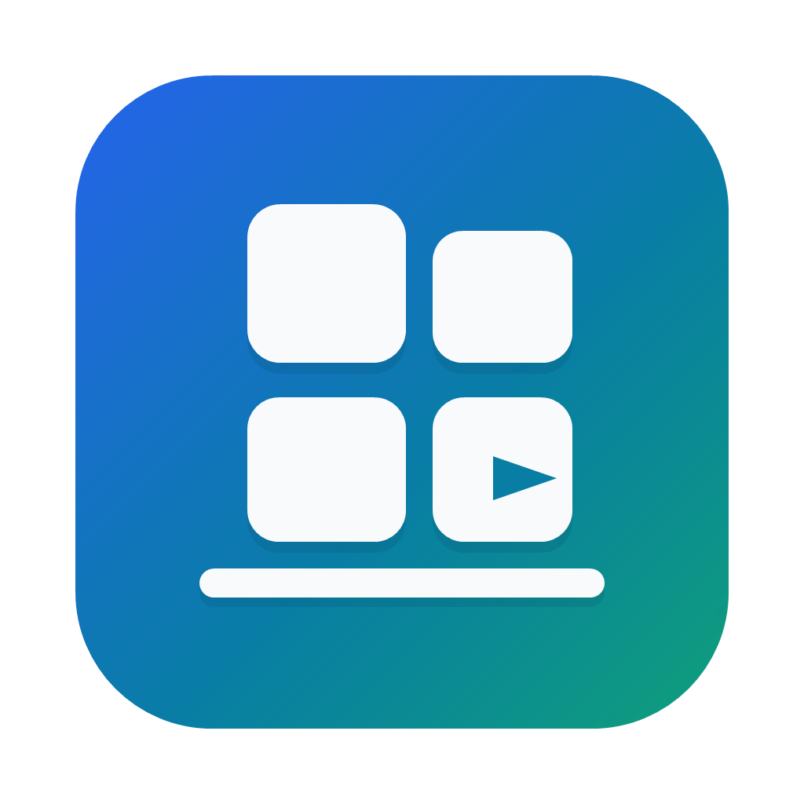

<p align="center">
  
</p>

<h1 align="center">AppShelf</h1>

<p align="center">
  A desktop shelf for local localhost projects.
</p>

<p align="center">
  <a href="README.zh-CN.md">中文文档</a>
</p>

<p align="center">
  
  
  
</p>


AppShelf is a Windows desktop app for managing localhost projects through a visual library. It is built for an AI-heavy local development workflow where projects multiply quickly, but humans should not need to remember start commands, ports, folders, or old chat history just to run them again.

Use it for local web apps, personal sites, blogs, docs, dashboards, games, demos, and tools. If a local command starts something useful at a localhost URL, AppShelf can keep it on your shelf.

## Highlights

- **One-click launch:** start, stop, restart, and open local projects from a desktop GUI.
- **Manifest-based registration:** discover projects from `.localapp.json` in folders you choose.
- **Agent-friendly workflow:** ask an AI agent to register a project once, then manage it from AppShelf.
- **Useful runtime context:** view status, logs, startup errors, ports, process IDs, and paths.
- **Local-first:** preferences stay in the AppShelf user registry; logs are not uploaded automatically.
- **Bilingual UI:** Chinese and English are supported.

## Why AppShelf

AI agents make it cheap to create many local projects. The friction moves elsewhere: startup commands live in README files, package scripts, terminal history, or old conversations.

AppShelf keeps those projects in one place so you can launch them like a small local app library instead of remembering every command.

## Current Status

AppShelf is an early preview.

- Windows only.
- Source-first repository.
- Local unsigned Windows unpacked builds are supported.
- No signed public installer yet.
- No environment installation or dependency repair.
- No Git repository cloning/import flow.
- No Docker Compose or remote deployment support.
- `.localapp.json` is a draft local convention, not a finalized standard.

## Quick Start

Requirements:

- Windows
- Node.js and npm

Install dependencies:

```powershell
npm install
```

Run in development:

```powershell
npm run dev
```

Or use the local helper:

```powershell
.\start-AppShelf.cmd
```

Create a local unsigned Windows unpacked build:

```powershell
npm run pack:win
```

The build is written to `release/win-unpacked/AppShelf.exe`. It is ignored by Git and is not a signed public release artifact.

## Register a Project

Minimal `.localapp.json`:

```json
{
  "name": "My Web App",
  "command": "npm run dev"
}
```

Recommended fields:

```json
{
  "$schema": "https://localapp.dev/schema/v0.json",
  "name": "My Web App",
  "description": "A short description of the app.",
  "icon": ".localapp/icon.png",
  "command": "npm run dev",
  "url": "http://localhost:5173",
  "port": 5173,
  "workingDirectory": "."
}
```

For agent-assisted registration, see [docs/AGENT_REGISTER_LOCALAPP.md](docs/AGENT_REGISTER_LOCALAPP.md). For the manifest reference, see [docs/LOCALAPP_MANIFEST_V0.md](docs/LOCALAPP_MANIFEST_V0.md).

## Safety Model

`.localapp.json` contains executable commands. Treat it like code.

AppShelf only scans folders you choose. It asks before running a command for the first time and asks again if the command changes. Only add projects you trust.

AppShelf is provided as a personal/open-source tool without warranty. You are responsible for reviewing local commands and deciding whether a project is safe to run.

## Development

Typecheck:

```powershell
npm run typecheck
```

Build:

```powershell
npm run build
```

Capture a sanitized README screenshot:

```powershell
npm run capture:ui
```

## Sample Project

The repository includes `examples/hello-localapp` as a deliberate sample project. It is a tiny local Node server with a `.localapp.json` manifest, useful for testing AppShelf's scan, start, stop, logs, and open actions without using a private project.

## Project Docs

- [SPEC.md](SPEC.md)
- [ARCHITECTURE.md](ARCHITECTURE.md)
- [docs/LOCALAPP_MANIFEST_V0.md](docs/LOCALAPP_MANIFEST_V0.md)
- [docs/AGENT_REGISTER_LOCALAPP.md](docs/AGENT_REGISTER_LOCALAPP.md)

## Acknowledgements

AppShelf was developed with assistance from OpenAI Codex.

## License

MIT. See [LICENSE](LICENSE).
