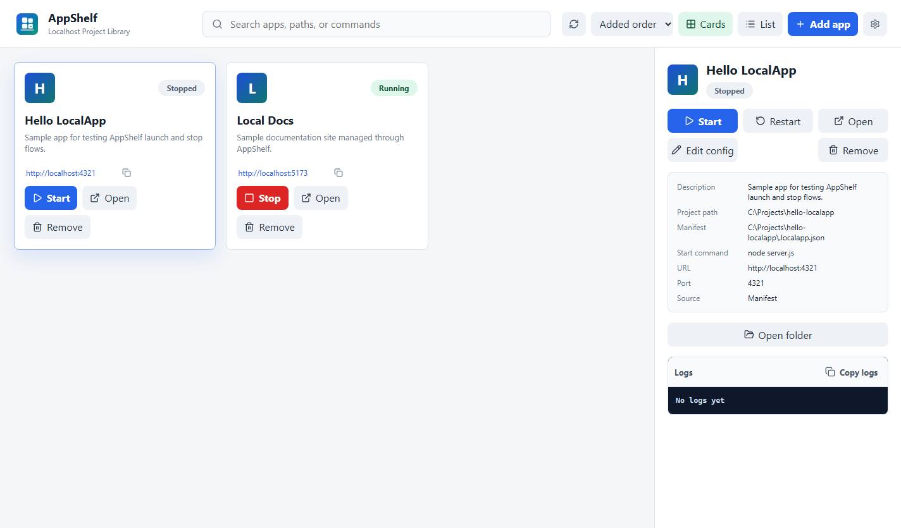

# AppShelf

AppShelf is a Windows desktop app for managing localhost projects through a visual library.

It is designed for an AI-heavy local development workflow: agents can generate many localhost projects, but the human should not need to remember startup commands, reopen terminal sessions, or search old chat logs just to run them again.

Those projects can be web apps, personal sites, blogs, docs sites, dashboards, games, demos, or local tools. The common requirement is simple: a local command starts something useful at a localhost URL.

Status: early preview, Windows-only. The repository is source-first; a local unsigned Windows unpacked build can be generated, but there is no signed public installer yet.



## What It Does

- Discover localhost projects from user-approved folders by reading `.localapp.json`.
- Manually register projects when no manifest exists.
- Start, stop, restart, and open projects from a desktop GUI.
- Show app status, logs, startup errors, ports, process IDs, and project paths.
- Keep local preferences in the AppShelf user registry.
- Support Chinese and English UI.

## What It Is Not

AppShelf is not an IDE, Docker replacement, PM2 GUI, package manager, remote deployment tool, or agent control plane.

The v0 goal is narrow: make localhost projects easy to find and start.

## Who It Is For

AppShelf is for people who keep many local projects around, especially projects generated or maintained with AI agents. It is useful when the project already runs locally, but the start command, port, or folder is easy to forget.

## Current Limitations

- Windows only.
- No signed installer yet.
- No environment installation or dependency repair.
- No Git repository cloning/import flow.
- No Docker Compose or remote deployment support.
- `.localapp.json` is a draft local convention, not a finalized standard.

## Safety Model

`.localapp.json` contains executable commands. Treat it like code.

AppShelf only scans folders the user chooses. It asks before running a command for the first time and asks again if the command changes. AppShelf does not upload logs automatically, does not manage secrets, and should only be pointed at trusted local projects.

## Local App Manifest

Minimal `.localapp.json`:

```json
{
  "name": "My Web App",
  "command": "npm run dev"
}
```

Recommended:

```json
{
  "$schema": "https://localapp.dev/schema/v0.json",
  "name": "My Web App",
  "description": "A short description of the app.",
  "icon": ".localapp/icon.png",
  "command": "npm run dev",
  "url": "http://localhost:5173",
  "port": 5173,
  "workingDirectory": "."
}
```

See [SPEC.md](SPEC.md) for the draft manifest spec and [docs/AGENT_REGISTER_LOCALAPP.md](docs/AGENT_REGISTER_LOCALAPP.md) for agent registration guidance.

## Development

Requirements:

- Windows
- Node.js and npm

Install dependencies:

```powershell
npm install
```

Run in development:

```powershell
npm run dev
```

Or use the local helper:

```powershell
.\start-AppShelf.cmd
```

Typecheck:

```powershell
npm run typecheck
```

Build:

```powershell
npm run build
```

Capture a sanitized README screenshot:

```powershell
npm run capture:ui
```

Create a local unsigned Windows unpacked build:

```powershell
npm run pack:win
```

This writes a testable desktop build to `release/win-unpacked/AppShelf.exe`. The output is ignored by Git and is not a signed public release artifact.

## Sample Project

The repository includes `examples/hello-localapp` as a deliberate sample project. It is a tiny local Node server with a `.localapp.json` manifest, useful for testing AppShelf's scan, start, stop, logs, and open actions without using a private project.

## Project Docs

- [PRODUCT_REQUIREMENTS.md](PRODUCT_REQUIREMENTS.md)
- [SPEC.md](SPEC.md)
- [ARCHITECTURE.md](ARCHITECTURE.md)
- [TASKS.md](TASKS.md)
- [docs/PUBLIC_RELEASE_CHECKLIST.md](docs/PUBLIC_RELEASE_CHECKLIST.md)

## License

MIT. See [LICENSE](LICENSE).
